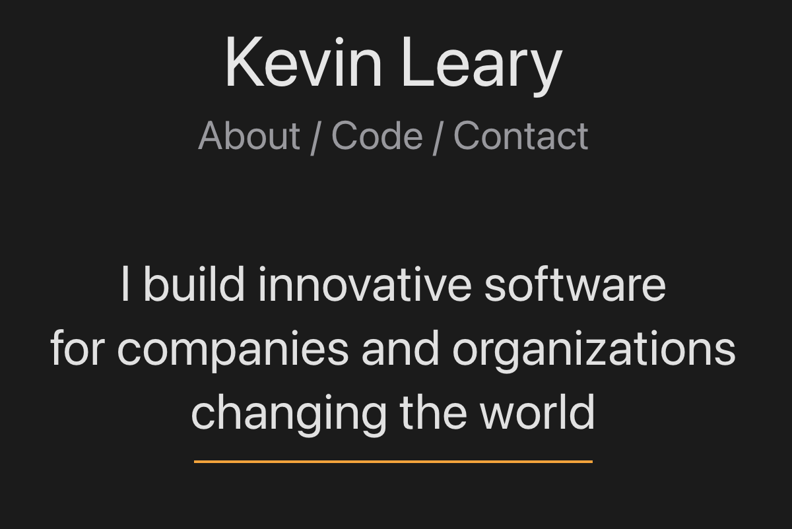

# ktleary.com - Personal Website

This is the repository for my personal website, ktleary.com, where I showcase my software development work and provide contact information. This website serves as a portfolio and a point of contact for anyone interested in my professional endeavors.

## Description

This project is a single-page web application built using React.js and styled with Styled Components. It showcases my software development projects and provides a way to reach out to me for potential collaborations or inquiries.



## Installation

To run this website locally, follow these steps:

1. Clone this repository to your local machine:

   ```bash
   git clone https://github.com/yourusername/ktleary.git
   ```

Navigate to the project directory:

```bash
cd ktleary
```

Install the required dependencies:

```bash
npm install
```

Start the development server:

```bash
npm start
```

Open your web browser and access the website at http://localhost:3000.

## Dependencies

The following libraries and tools are used in this project:

React - JavaScript library for building user interfaces.
Styled Components - CSS-in-JS library for styling components.
React Router - Routing library for React applications.
React Helmet - Library for managing document head tags in React.
Ramda - Functional programming library.
nanoid - A tiny, secure, URL-friendly unique string ID generator.

## Usage

Feel free to explore my website at ktleary.com. You can view my software development projects, learn more about my background, and find my contact information.

## Scripts

- npm start: Starts the development server and opens the website in your default web browser.
- npm run build: Builds the production-ready version of the website.
- npm test: Runs tests for the website.
- npm run test:coverage: Runs tests with coverage reporting.

## License

This project is licensed under the GPL-3.0-or-later License.

## Contact

Kevin Leary

- Email: kevin@ktleary.com
- LinkedIn: in/ktleary
- GitHub: ktleary

Feel free to reach out if you have any questions, feedback, or collaboration opportunities.

Thank you for visiting my personal website!
